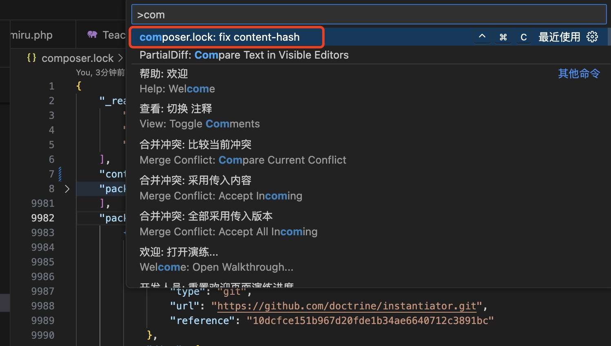
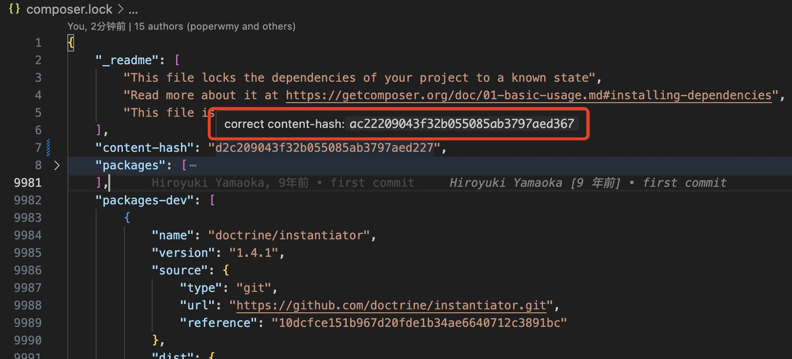

# composer-lock-fix-content-hash README

## Features

auto fixed composer.lock content-hash

## images

### keybindings

- window (ctrl+alt+c)
- Mac(ctrl+cmd+c)

### command
- composer.lock: fix content-hash

